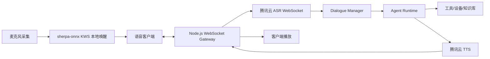
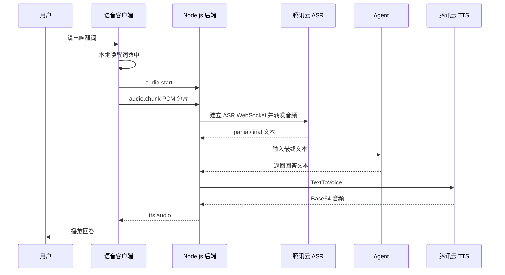

# 智能语音对话系统技术设计文档

更新时间：2026-05-22

## 1. 背景与目标

设计并实现一个基于 `Node.js` 的智能语音对话系统，支持：

1. 唤醒词唤醒；
2. 用户语音采集；
3. 腾讯云 ASR 语音转文字；
4. Agent 推理与工具调用；
5. 腾讯云 TTS 语音合成并播放回答。

> 说明：ASR 是语音识别，不能用于“语音输出”。语音回答需要使用腾讯云语音合成 TTS。本文按“识别使用腾讯云 ASR，输出使用腾讯云 TTS”设计。

## 2. 技术调研结论

| 能力 | 方案 | 结论 |
| --- | --- | --- |
| 唤醒词 | `sherpa-onnx KWS` + 本地 `keywords` 文件 | 已选定并通过 Demo 验证；默认唤醒词为“小余小余”，本地检测，不持续上传环境音 |
| 实时语音识别 | 腾讯云 ASR 实时语音识别 WebSocket | 适合对话场景，可边说边出字；需自行处理 WebSocket 签名和音频分片 |
| 短语音识别 | 腾讯云 ASR `SentenceRecognition` | 适合 60 秒内短音频，Node.js 官方通用 SDK 可直接调用，可作为降级方案 |
| 语音输出 | 腾讯云 TTS `TextToVoice` | Node.js 可通过 `tencentcloud-sdk-nodejs-tts` 调用，返回 Base64 音频 |
| Agent 推理 | OpenAI Agents SDK（`@openai/agents`） | 使用官方 TypeScript Agent 框架实现 Agent、Tools、上下文和运行链路 |
| 客户端 | Web / Electron / 树莓派 Node 进程 | 推荐前端/设备采集音频，Node 后端负责云服务鉴权和 Agent 编排 |

### 2.1 腾讯云 ASR 实时识别要点

官方实时 ASR 使用 WebSocket：

```text
wss://asr.cloud.tencent.com/asr/v2/<appid>?{query}
```

关键要求：

- 协议：`wss`；
- 音频：推荐 `16kHz`、`16bit`、单声道 `pcm`；
- 分片：建议每 `200ms` 发送 `200ms` 音频，16k PCM 约 `6400` 字节；
- 断句：`needvad=1`，可结合 `vad_silence_time`；
- 结果：`slice_type=1` 为中间结果，`slice_type=2` 为稳定最终句；
- 结束：客户端发送 `{"type":"end"}`；
- 每个连接必须使用新的 `voice_id`；
- 签名：对除 `signature` 外参数字典序排序，拼接签名原文，使用 `SecretKey` 做 `HMAC-SHA1`，再 `Base64` 和 URL 编码。

### 2.2 腾讯云 ASR 一句话识别要点

`SentenceRecognition` 适合兜底或非实时场景：

- 域名：`asr.tencentcloudapi.com`；
- API 版本：`2019-06-14`；
- 音频限制：不超过 `60s`，文件不超过 `3MB`；
- 支持本地音频 Base64 或 URL；
- 关键参数：`EngSerViceType`、`SourceType`、`VoiceFormat`、`Data`、`DataLen`、`Url`；
- Node.js 可用腾讯云通用 SDK 调用。

### 2.3 腾讯云 TTS 语音合成要点

`TextToVoice` 用于语音回答：

- 域名：`tts.tencentcloudapi.com`；
- API 版本：`2019-08-23`；
- SDK：推荐 `tencentcloud-sdk-nodejs-tts`；
- 文本限制：中文约 `150` 字，英文约 `500` 字母；长回答需拆句；
- 推荐输出格式：`mp3`；
- 返回：`Audio` 为 Base64 字符串，服务端转为 `Buffer` 后下发；
- 关键参数：`Text`、`SessionId`、`VoiceType`、`Codec`、`SampleRate`、`Speed`、`Volume`。

推荐默认参数：

```json
{
  "ModelType": 1,
  "VoiceType": 1001,
  "Codec": "mp3",
  "SampleRate": 16000,
  "Speed": 0,
  "Volume": 0
}
```

## 3. 总体架构



推荐拆分为两端：

1. **语音客户端**：负责麦克风采集、唤醒词检测、播放、打断；可用 Web、Electron、树莓派 Node 进程实现。
2. **Node.js 后端**：负责腾讯云鉴权、ASR 转写、Agent 编排、TTS 合成、日志和安全控制。

## 4. 核心流程

### 4.1 正常对话流程



### 4.2 状态机

```text
idle
  -> wake_listening
  -> recording
  -> transcribing
  -> thinking
  -> speaking
  -> idle
```

打断策略：

- `speaking` 状态再次检测到唤醒词或语音活动时，发送 `interrupt`；
- 后端取消当前 TTS 播放流和 Agent 生成；
- 状态回到 `recording`。

## 5. 模块设计

### 5.1 `VoiceClient`

职责：

- 采集麦克风音频；
- 本地唤醒词检测；
- 音频重采样为 `16kHz/16bit/mono PCM`；
- 通过 WebSocket 上传音频；
- 接收并播放 TTS 音频；
- 支持播放打断。

可选实现：

- Web：`AudioWorklet` + WebSocket；
- Electron：复用 Web 音频能力；
- 纯 Node 设备端：`node-record-lpcm16` / `mic` + 本地播放器。

### 5.2 `VoiceGateway`

职责：

- 维护客户端 WebSocket 会话；
- 校验客户端消息格式；
- 控制会话状态机；
- 将音频流转发到 ASR 服务；
- 将 ASR、Agent、TTS 结果统一推送给客户端。

### 5.3 `WakeWordService`

采用 `sherpa-onnx KWS` 实现本地唤醒，当前 Demo 已验证电脑麦克风监听和“小余小余”唤醒链路。

职责：

- 基于 `sherpa-onnx-node` 在本地持续监听麦克风音频；
- 默认唤醒词为“小余小余”；
- 加载 `models/kws/keywords-xiaoyu.txt` 作为关键词配置；
- 使用 `models/sherpa-onnx-kws-zipformer-wenetspeech-3.3M-2024-01-01` 中文 KWS 模型；
- 命中唤醒词后进入录音；
- 通过 `keywords` 文件配置 boosting score 和 trigger threshold；
- 提供误唤醒阈值、冷却时间、连续确认策略。

设计原则：唤醒词不放在云端做，避免隐私风险和无效云调用成本。

### 5.4 `TencentAsrRealtimeService`

职责：

- 生成 ASR WebSocket 签名 URL；
- 建立腾讯云 ASR WebSocket；
- 按 200ms 节奏发送音频分片；
- 解析 `slice_type=1/2` 结果；
- 输出 `asr.partial` 和 `asr.final`；
- 处理重连、超时、鉴权失败、并发超限。

推荐配置：

```env
TENCENTCLOUD_APP_ID=
TENCENTCLOUD_SECRET_ID=
TENCENTCLOUD_SECRET_KEY=
ASR_ENGINE_MODEL_TYPE=16k_zh
ASR_VOICE_FORMAT=1
ASR_NEED_VAD=1
ASR_VAD_SILENCE_TIME=1000
```

### 5.5 `AgentRuntime`

采用 OpenAI Agents SDK TypeScript 框架实现，核心依赖为 `@openai/agents` 和 `zod`。

职责：

- 接收 ASR 输出的用户文本；
- 使用 `Agent` 定义语音助手身份、行为边界和工具使用策略；
- 使用 `tool()` 封装智能家居控制、天气、日程、搜索等能力；
- 使用 `run()` 执行 Agent 推理；
- 通过 `context` 注入 `sessionId`、用户信息、设备权限和 Home Assistant 客户端；
- 输出最终自然语言回答，交给 TTS 合成。

推荐框架代码：

```ts
import { Agent, run, tool } from '@openai/agents';
import { z } from 'zod';

interface VoiceAgentContext {
  sessionId: string;
  userId?: string;
}

const controlDeviceTool = tool({
  name: 'control_device',
  description: 'Control a Home Assistant entity after permission checks.',
  parameters: z.object({
    entityId: z.string(),
    action: z.enum(['turn_on', 'turn_off']),
  }),
  async execute({ entityId, action }) {
    // TODO: call Home Assistant service here.
    return { ok: true, entityId, action };
  },
});

const voiceAgent = new Agent<VoiceAgentContext>({
  name: 'Home Voice Assistant',
  model: process.env.OPENAI_AGENT_MODEL,
  instructions: `
你是家庭智能语音助手。
回答要简短、自然，适合语音播报。
需要控制设备时优先调用工具，不要编造执行结果。
高风险操作必须二次确认。
`.trim(),
  tools: [controlDeviceTool],
});

export async function runVoiceAgent(input: {
  sessionId: string;
  text: string;
}) {
  const result = await run(voiceAgent, input.text, {
    context: {
      sessionId: input.sessionId,
    },
  });

  return String(result.finalOutput ?? '');
}
```

推荐配置：

```env
OPENAI_API_KEY=
OPENAI_AGENT_MODEL=gpt-4.1
```

后续如需复杂多 Agent，可使用 OpenAI Agents SDK 的 `handoffs` 或 `Agent.asTool()` 实现专家 Agent 分工。

### 5.6 `TencentTtsService`

职责：

- 拆分长回答；
- 调用腾讯云 `TextToVoice`；
- 将 Base64 音频转为 `Buffer`；
- 设置音色、语速、音量；
- 缓存常见短文本，例如“好的”“已完成”。

推荐依赖：

```text
tencentcloud-sdk-nodejs-tts
```

推荐配置：

```env
TTS_REGION=ap-beijing
TTS_ENDPOINT=tts.tencentcloudapi.com
TTS_VOICE_TYPE=1001
TTS_CODEC=mp3
TTS_SAMPLE_RATE=16000
TTS_SPEED=0
TTS_VOLUME=0
```

## 6. WebSocket 协议设计

### 6.1 客户端到服务端

```json
{ "type": "audio.start", "sessionId": "uuid", "sampleRate": 16000, "format": "pcm_s16le" }
```

```json
{ "type": "audio.chunk", "sessionId": "uuid", "payload": "base64-pcm" }
```

```json
{ "type": "audio.end", "sessionId": "uuid" }
```

```json
{ "type": "interrupt", "sessionId": "uuid" }
```

```json
{ "type": "text.input", "sessionId": "uuid", "text": "打开客厅灯" }
```

### 6.2 服务端到客户端

```json
{ "type": "asr.partial", "sessionId": "uuid", "text": "打开客" }
```

```json
{ "type": "asr.final", "sessionId": "uuid", "text": "打开客厅灯" }
```

```json
{ "type": "agent.final", "sessionId": "uuid", "text": "好的，已为你打开客厅灯。" }
```

```json
{ "type": "tts.audio", "sessionId": "uuid", "codec": "mp3", "payload": "base64-audio" }
```

```json
{ "type": "error", "sessionId": "uuid", "code": "ASR_AUTH_FAILED", "message": "语音识别鉴权失败" }
```

## 7. 推荐目录结构

```text
src/
  app.ts
  config/
    env.ts
  gateway/
    voice-gateway.ts
    voice-protocol.ts
  voice/
    tencent-asr-realtime.service.ts
    tencent-asr-sentence.service.ts
    tencent-tts.service.ts
    audio-utils.ts
  agent/
    agent-runtime.ts
    openai-agent-runtime.ts
    tools/
      home-assistant.tool.ts
      weather.tool.ts
  session/
    session-manager.ts
  common/
    logger.ts
    errors.ts
    rate-limit.ts
```

## 8. 关键依赖建议

| 依赖 | 用途 |
| --- | --- |
| `ws` | WebSocket 服务端、浏览器麦克风 Demo 和腾讯云 ASR WebSocket 客户端 |
| `sherpa-onnx-node` | 本地中文唤醒词检测，默认监听“小余小余” |
| `@openai/agents` | OpenAI Agents SDK，负责 Agent、Tools、运行循环和上下文 |
| `tencentcloud-sdk-nodejs-tts` | 腾讯云 TTS 调用 |
| `tencentcloud-sdk-nodejs` 或 `tencentcloud-sdk-nodejs-asr` | 一句话识别兜底 |
| `zod` | 协议和配置校验 |
| `pino` | 结构化日志 |
| `uuid` | `sessionId`、`voice_id`、`SessionId` |
| `dotenv` | 本地环境变量加载 |
| `p-queue` | TTS/Agent 并发控制 |

客户端若为 Node 设备端，可补充：

| 依赖 | 用途 |
| --- | --- |
| `node-record-lpcm16` / `mic` | 麦克风录音 |
| `speaker` / 系统播放器 | 播放音频 |
| `sherpa-onnx-node` | 本地唤醒词检测，加载 `models/kws/keywords-xiaoyu.txt` |

## 9. 安全设计

1. 腾讯云 `SecretId` / `SecretKey` 只允许存在服务端环境变量或密钥管理系统中；
2. 前端/设备端不直接访问腾讯云 ASR/TTS；
3. 对 WebSocket 客户端做身份校验和频率限制；
4. `OPENAI_API_KEY` 只允许存在服务端环境变量或密钥管理系统中；
5. 对 `VoiceType`、`Codec`、`SampleRate` 等参数使用白名单；
6. OpenAI Agent 工具调用必须做权限控制，尤其是开锁、支付、删除等高风险动作；
7. 日志不记录完整密钥、原始音频和敏感个人信息；
8. 腾讯云 CAM 建议使用最小权限子账号；
9. 对 ASR/TTS/OpenAI Agent 调用做并发限制和成本监控。

## 10. 错误处理与降级

| 场景 | 处理策略 |
| --- | --- |
| 唤醒失败 | 提供手动按键输入或文本输入 |
| ASR WebSocket 鉴权失败 | 返回 `ASR_AUTH_FAILED`，提示检查密钥和服务器时间 |
| ASR 超时 | 结束本轮录音，提示用户重试 |
| ASR 并发超限 | 排队或拒绝新会话 |
| OpenAI Agent 超时 | 取消本轮 `run()`，返回“我暂时没想明白，请稍后再试” |
| TTS 文本过长 | 自动按句切分后分段合成 |
| TTS 限流 | 命中缓存优先；否则文本回答降级 |
| 播放中打断 | 停止当前音频，取消未完成任务，进入新一轮录音 |

## 11. 性能目标

| 指标 | 目标 |
| --- | --- |
| 唤醒响应 | < 300ms |
| ASR 首字返回 | < 1000ms |
| 端到端首轮回答 | 2s - 5s，取决于 Agent 模型 |
| TTS 首段返回 | < 1500ms |
| 音频分片 | 200ms 一包 |
| 单会话并发任务 | 同时仅允许 1 个活跃 Agent 和 1 个 TTS 流 |

## 12. 实施计划

### 阶段一：最小可用版本

- Node.js WebSocket Gateway；
- 文本输入触发 Agent；
- TTS 合成并返回音频；
- 基础日志和环境变量配置。

### 阶段二：语音输入闭环

- 客户端麦克风采集；
- 腾讯云 ASR 实时 WebSocket；
- ASR final 文本触发 Agent；
- 播放 TTS 音频。

### 阶段三：唤醒词与打断

- 使用 `sherpa-onnx KWS` 接入本地唤醒；
- 默认唤醒词为“小余小余”；
- 基于 `demos/kws-mic-server.js` 的麦克风 Demo 迁移到正式 `WakeWordService`；
- 增加 VAD 静音结束；
- 支持播放中打断；
- 优化状态机。

### 阶段四：智能家居 Agent

- 接入 Home Assistant 或其他设备控制 API；
- 工具权限校验；
- 多轮上下文和设备状态记忆；
- 增加审计日志。

## 13. 待确认问题

1. 运行形态：Web、Electron、树莓派、macOS 常驻进程还是服务器服务？
2. OpenAI Agent 使用的具体模型与预算限制；
3. 是否需要接入 Home Assistant 设备控制？
4. 是否需要多用户、权限隔离和声纹识别？

## 14. 参考资料

- 腾讯云 ASR 实时语音识别 WebSocket：`https://cloud.tencent.com/document/product/1093/48982`
- 腾讯云 ASR SDK 概览：`https://cloud.tencent.com/document/product/1093/52554`
- 腾讯云 ASR 一句话识别：`https://cloud.tencent.com/document/product/1093/35646`
- 腾讯云 TTS 服务端 API 快速接入：`https://cloud.tencent.com/document/product/1073/56640`
- 腾讯云 TTS TextToVoice：`https://cloud.tencent.com/document/product/1073/37995`
