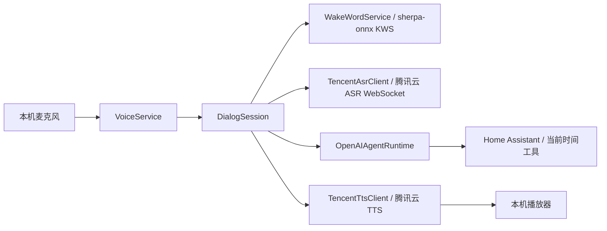
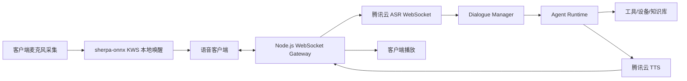
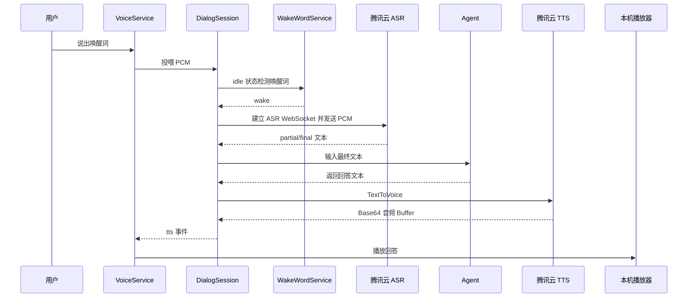
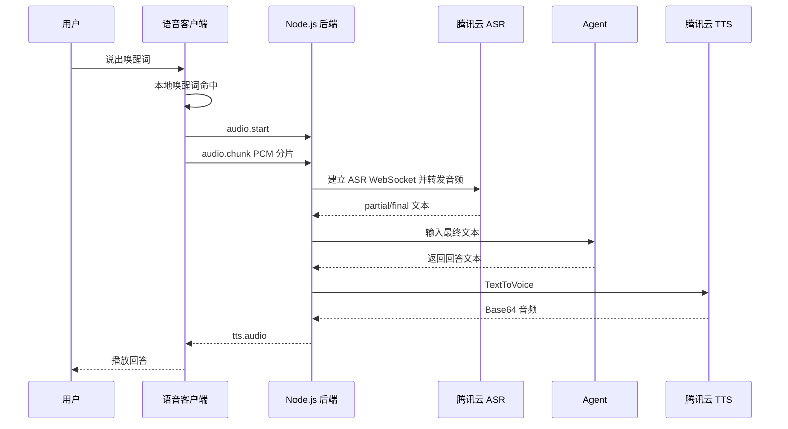

# 智能语音对话系统技术设计文档

更新时间：2026-05-23

## 1. 背景与目标

设计并实现一个基于 `Node.js` 的智能语音对话系统，支持：

1. 唤醒词唤醒；
2. 用户语音采集；
3. 腾讯云 ASR 语音转文字；
4. Agent 推理与工具调用；
5. 腾讯云 TTS 语音合成并播放回答。

> 说明：ASR 是语音识别，不能用于“语音输出”。语音回答需要使用腾讯云语音合成 TTS。本文按“识别使用腾讯云 ASR，输出使用腾讯云 TTS”设计。

## 2. 技术调研结论

| 能力 | 方案 | 结论 |
| --- | --- | --- |
| 唤醒词 | `sherpa-onnx KWS` + 本地 `keywords` 文件 | 已选定并通过 Demo 验证；默认唤醒词为“菜包菜包”，本地检测，不持续上传环境音 |
| 实时语音识别 | 腾讯云 ASR 实时语音识别 WebSocket | 适合对话场景，可边说边出字；需自行处理 WebSocket 签名和音频分片 |
| 短语音识别 | 腾讯云 ASR `SentenceRecognition` | 适合 60 秒内短音频，Node.js 官方通用 SDK 可直接调用，可作为降级方案 |
| 语音输出 | 腾讯云 TTS `TextToVoice` | Node.js 可通过 `tencentcloud-sdk-nodejs-tts` 调用，返回 Base64 音频 |
| Agent 推理 | OpenAI Agents SDK（`@openai/agents`） | 使用官方 TypeScript Agent 框架实现 Agent、Tools、上下文和运行链路 |
| 客户端 | 本机 CLI / Web / Electron / 树莓派 Node 进程 | 当前已落地本机 CLI 常驻进程；WebSocket Gateway 与浏览器完整客户端仍是目标架构 |

### 2.1 当前实现状态

当前代码已从纯设计推进到“本机 CLI 语音闭环”形态：

- `src/cli/cli.ts` 提供 `start`、`stop`、`status`、`logs`、`ask` 命令；
- `src/cli/voice-service.ts` 负责本机麦克风、`DialogSession` 和本机播放器编排；
- `src/wake/wake-word-service.ts` 已封装正式唤醒词服务；
- `src/asr/tencent-asr-client.ts` 已实现腾讯云实时 ASR WebSocket；
- `src/agent/openai-agent-runtime.ts` 已实现 OpenAI Agents SDK 运行时，支持 `OPENAI_BASE_URL`；
- `src/tts/tencent-tts-client.ts` 已实现腾讯云 TTS 与长文本拆句；
- `src/agent/tools/home-assistant.tool.ts` 已实现 Home Assistant 控制工具的基础 HTTP 调用。

尚未实现或仍属于目标设计：

- `src/gateway/` WebSocket Gateway；
- 完整浏览器语音助手页面 `public/voice.html`；
- 第 6 节定义的客户端/服务端 WebSocket 协议；
- 播放中打断、TTS 缓存、一句话识别兜底、多轮上下文记忆。

### 2.2 腾讯云 ASR 实时识别要点

官方实时 ASR 使用 WebSocket：

```text
wss://asr.cloud.tencent.com/asr/v2/<appid>?{query}
```

关键要求：

- 协议：`wss`；
- 音频：推荐 `16kHz`、`16bit`、单声道 `pcm`；
- 分片：建议每 `200ms` 发送 `200ms` 音频，16k PCM 约 `6400` 字节；
- 断句：`needvad=1`，可结合 `vad_silence_time`；
- 结果：`slice_type=1` 为中间结果，`slice_type=2` 为稳定最终句；
- 结束：客户端发送 `{"type":"end"}`；
- 每个连接必须使用新的 `voice_id`；
- 签名：对除 `signature` 外参数字典序排序，拼接签名原文，使用 `SecretKey` 做 `HMAC-SHA1`，再 `Base64` 和 URL 编码。

### 2.3 腾讯云 ASR 一句话识别要点

`SentenceRecognition` 适合兜底或非实时场景：

- 域名：`asr.tencentcloudapi.com`；
- API 版本：`2019-06-14`；
- 音频限制：不超过 `60s`，文件不超过 `3MB`；
- 支持本地音频 Base64 或 URL；
- 关键参数：`EngSerViceType`、`SourceType`、`VoiceFormat`、`Data`、`DataLen`、`Url`；
- Node.js 可用腾讯云通用 SDK 调用。

### 2.4 腾讯云 TTS 语音合成要点

`TextToVoice` 用于语音回答：

- 域名：`tts.tencentcloudapi.com`；
- API 版本：`2019-08-23`；
- SDK：推荐 `tencentcloud-sdk-nodejs-tts`；
- 文本限制：中文约 `150` 字，英文约 `500` 字母；长回答需拆句；
- 推荐输出格式：`mp3`；
- 返回：`Audio` 为 Base64 字符串，服务端转为 `Buffer` 后下发；
- 关键参数：`Text`、`SessionId`、`VoiceType`、`Codec`、`SampleRate`、`Speed`、`Volume`。

当前项目默认参数：

```json
{
  "ModelType": 1,
  "VoiceType": 101001,
  "Codec": "mp3",
  "SampleRate": 16000,
  "Speed": 0
}
```

`Volume` 暂未接入配置。

## 3. 总体架构

### 3.1 当前已实现架构：本机 CLI 常驻进程



当前运行形态为本机 Node.js 进程：

1. `VoiceService` 使用本机麦克风持续采集 `16kHz/16bit/mono PCM`；
2. `DialogSession` 在 `idle` 状态把音频投喂给 `WakeWordService`；
3. 唤醒后进入 `listening`，将音频转发到腾讯云 ASR；
4. ASR 最终文本触发 Agent；
5. Agent 回答经 TTS 合成后由本机播放器播放。

### 3.2 目标架构：WebSocket Gateway + 多客户端



目标形态推荐拆分为两端：

1. **语音客户端**：负责麦克风采集、唤醒词检测、播放、打断；可用 Web、Electron、树莓派 Node 进程实现。
2. **Node.js 后端**：负责腾讯云鉴权、ASR 转写、Agent 编排、TTS 合成、日志和安全控制。

> 当前仓库尚未实现 `src/gateway/` 与完整浏览器语音助手页面，相关内容属于后续目标。

## 4. 核心流程

### 4.1 正常对话流程

当前 CLI 流程：



目标 WebSocket Gateway 流程：



### 4.2 状态机

当前 `DialogSession` 已实现的状态机：

```text
idle
  -> listening
  -> thinking
  -> speaking
  -> idle
```

状态说明：

- `idle`：持续做本地唤醒词检测；
- `listening`：连接腾讯云 ASR 并转发 PCM；
- `thinking`：调用 Agent；
- `speaking`：分段调用 TTS 并播放。

目标状态机可继续细化为：

```text
idle
  -> wake_listening
  -> recording
  -> transcribing
  -> thinking
  -> speaking
  -> idle
```

打断策略仍未落地，后续需要：

- `speaking` 状态继续监听唤醒词或语音活动；
- 命中后停止当前播放器、取消未完成 TTS/Agent 任务；
- 状态回到 `listening` 或新一轮 `recording`。

## 5. 模块设计

### 5.1 `VoiceClient`

> 目标设计。当前已实现的是本机 `VoiceService`，尚未实现完整 Web/Electron `VoiceClient`。

职责：

- 采集麦克风音频；
- 本地唤醒词检测；
- 音频重采样为 `16kHz/16bit/mono PCM`；
- 通过 WebSocket 上传音频；
- 接收并播放 TTS 音频；
- 支持播放打断。

可选实现：

- Web：`AudioWorklet` + WebSocket；
- Electron：复用 Web 音频能力；
- 纯 Node 设备端：`node-record-lpcm16` / `mic` + 本地播放器。

### 5.2 `VoiceGateway`

> 目标设计。当前仓库尚未实现 `src/gateway/`。

职责：

- 维护客户端 WebSocket 会话；
- 校验客户端消息格式；
- 控制会话状态机；
- 将音频流转发到 ASR 服务；
- 将 ASR、Agent、TTS 结果统一推送给客户端。

### 5.3 `WakeWordService`

采用 `sherpa-onnx KWS` 实现本地唤醒，当前已从 Demo 验证推进为正式服务封装。

当前实现：

- 基于 `sherpa-onnx-node`；
- 不直接采集麦克风，而是接收外部传入的 `16kHz/16bit/mono PCM`；
- 默认唤醒词为“菜包菜包”；
- 默认加载 `models/kws/keywords-caibao.txt`；
- 默认模型目录为 `models/sherpa-onnx-kws-zipformer-wenetspeech-3.3M-2024-01-01`；
- 命中唤醒词后向 `DialogSession` 发出 `wake` 事件；
- 通过 `keywords` 文件配置 boosting score 和 trigger threshold；
- 默认冷却时间为 `1500ms`，避免短时间重复触发。

设计原则：唤醒词不放在云端做，避免隐私风险和无效云调用成本。

### 5.4 `TencentAsrClient`（实时 ASR）

职责：

- 生成 ASR WebSocket 签名 URL；
- 建立腾讯云 ASR WebSocket；
- 按 200ms 节奏发送音频分片；
- 解析 `slice_type=1/2` 结果；
- 输出 `asr.partial` 和 `asr.final`；
- 处理重连、超时、鉴权失败、并发超限。

当前已实现配置：

```env
TENCENTCLOUD_APP_ID=
TENCENTCLOUD_SECRET_ID=
TENCENTCLOUD_SECRET_KEY=
ASR_ENGINE_MODEL_TYPE=16k_zh
```

当前实现说明：

- `voice_format=1`、`needvad=1` 在代码中固定；
- 本机麦克风默认按约 `100ms/3200 bytes` PCM 帧输出；
- 一句话识别 `SentenceRecognition` 兜底暂未实现。

规划中配置：

```env
ASR_VOICE_FORMAT=1
ASR_NEED_VAD=1
ASR_VAD_SILENCE_TIME=1000
```

### 5.5 `AgentRuntime`

当前实现为 `OpenAIAgentRuntime`，采用 OpenAI Agents SDK TypeScript 框架，核心依赖为 `@openai/agents` 和 `zod`。

职责：

- 接收 ASR 输出的用户文本；
- 使用 `Agent` 定义语音助手身份、行为边界和工具使用策略；
- 使用 `tool()` 封装智能家居控制、当前时间等能力；
- 使用 `Runner` 执行 Agent 推理，最大轮次当前为 `6`；
- 通过 `context` 注入 `sessionId` 和 Home Assistant 配置；
- 输出最终自然语言回答，交给 TTS 合成。

当前实现要点：

- 支持 `OPENAI_BASE_URL`，可接入兼容 OpenAI 协议的第三方网关；
- 对腾讯 TokenHub、DeepSeek 等兼容场景做了 Chat Completions fallback；
- 禁用 tracing，避免本地语音服务产生额外追踪上报；
- 已接入工具：`control_device`、`get_current_time`。

推荐配置：

```env
OPENAI_API_KEY=
OPENAI_BASE_URL=
OPENAI_AGENT_MODEL=gpt-4.1
```

Home Assistant 工具当前已部分实现：

- 支持动作：`turn_on`、`turn_off`、`toggle`；
- 允许 domain：`light`、`switch`、`fan`、`media_player`、`climate`、`cover`、`scene`、`script`；
- 配置 `HOME_ASSISTANT_BASE_URL` 和 `HOME_ASSISTANT_TOKEN` 后调用 `/api/services/{domain}/{action}`；
- 未配置 Home Assistant 时返回 mock 结果，便于本地联调。

尚未实现：设备发现、中文别名映射、高风险动作二次确认、工具调用审计日志。

后续如需复杂多 Agent，可使用 OpenAI Agents SDK 的 `handoffs` 或 `Agent.asTool()` 实现专家 Agent 分工。

### 5.6 `TencentTtsClient`

当前实现为 `TencentTtsClient`。

已实现：

- 调用腾讯云 `TextToVoice`；
- 将 Base64 音频转为 `Buffer`；
- 支持音色、语速、采样率、编码格式配置；
- 按中文/英文标点和最大长度拆分长回答，默认单段约 `120` 字符；
- `DialogSession` 会按拆分顺序逐段合成并播放。

尚未实现：

- 常见短文本 TTS 缓存；
- `Volume` 配置；
- `TTS_ENDPOINT` 配置化。

推荐依赖：

```text
tencentcloud-sdk-nodejs-tts
```

当前已实现配置：

```env
TTS_REGION=ap-beijing
TTS_VOICE_TYPE=101001
TTS_CODEC=mp3
TTS_SAMPLE_RATE=16000
TTS_SPEED=0
```

规划中配置：

```env
TTS_ENDPOINT=tts.tencentcloudapi.com
TTS_VOLUME=0
```

## 6. WebSocket 协议设计

> 当前仓库尚未实现 WebSocket Gateway。本节为目标协议设计，当前真实运行链路使用 `DialogSession` 的 Node.js `EventEmitter` 事件。

### 6.1 当前内部事件

`DialogSession` 当前对上层暴露：

| 事件 | 说明 |
| --- | --- |
| `state` | 状态变化，包含 `prev`、`state` |
| `wake` | 唤醒词命中 |
| `asr` | ASR 中间结果、最终结果、最终完整文本 |
| `agent` | Agent 最终回答文本 |
| `tts` | TTS 分段音频 `Buffer` |
| `error` | ASR、Agent、TTS 或状态机错误 |

### 6.2 目标客户端到服务端协议

```json
{ "type": "audio.start", "sessionId": "uuid", "sampleRate": 16000, "format": "pcm_s16le" }
```

```json
{ "type": "audio.chunk", "sessionId": "uuid", "payload": "base64-pcm" }
```

```json
{ "type": "audio.end", "sessionId": "uuid" }
```

```json
{ "type": "interrupt", "sessionId": "uuid" }
```

```json
{ "type": "text.input", "sessionId": "uuid", "text": "打开客厅灯" }
```

### 6.3 目标服务端到客户端协议

```json
{ "type": "asr.partial", "sessionId": "uuid", "text": "打开客" }
```

```json
{ "type": "asr.final", "sessionId": "uuid", "text": "打开客厅灯" }
```

```json
{ "type": "agent.final", "sessionId": "uuid", "text": "好的，已为你打开客厅灯。" }
```

```json
{ "type": "tts.audio", "sessionId": "uuid", "codec": "mp3", "payload": "base64-audio" }
```

```json
{ "type": "error", "sessionId": "uuid", "code": "ASR_AUTH_FAILED", "message": "语音识别鉴权失败" }
```

## 7. 目录结构

### 7.1 当前实际结构

```text
src/
  agent/
    openai-agent-runtime.ts
    tools/
      get-current-time.tool.ts
      home-assistant.tool.ts
  asr/
    tencent-asr-client.ts
  cli/
    audio-io.ts
    cli.ts
    voice-service.ts
  common/
    logger.ts
  config/
    env.ts
  dialog/
    dialog-session.ts
  tts/
    tencent-tts-client.ts
  wake/
    wake-word-service.ts
```

### 7.2 目标扩展结构

```text
src/
  gateway/
    voice-gateway.ts
    voice-protocol.ts
  voice/
    tencent-asr-sentence.service.ts
    audio-utils.ts
  session/
    session-manager.ts
  common/
    errors.ts
    rate-limit.ts
```

## 8. 关键依赖

### 8.1 当前已使用依赖

| 依赖 | 用途 |
| --- | --- |
| `@openai/agents` | OpenAI Agents SDK，负责 Agent、Tools、运行循环和上下文 |
| `dotenv` | 本地环境变量加载 |
| `node-microphone` | 本机麦克风录音 |
| `sherpa-onnx-node` | 本地中文唤醒词检测，默认监听“菜包菜包” |
| `tencentcloud-sdk-nodejs-tts` | 腾讯云 TTS 调用 |
| `ws` | 腾讯云 ASR WebSocket 客户端，以及 KWS Demo WebSocket 服务 |
| `zod` | Agent tool 参数校验 |

### 8.2 当前未使用或规划中依赖

| 依赖 | 状态 |
| --- | --- |
| `tencentcloud-sdk-nodejs` / `tencentcloud-sdk-nodejs-asr` | 一句话识别兜底暂未实现 |
| `pino` | 当前使用自定义 JSON logger，暂未引入 |
| `uuid` | 当前使用 `node:crypto.randomUUID()`，暂未引入 |
| `p-queue` | TTS/Agent 并发队列暂未实现 |
| `speaker` | 当前优先调用系统播放器或 `AUDIO_PLAY_CMD`，暂未引入 |

### 8.3 当前启动方式

```bash
npm run start
npm run start -- --daemon
npm run stop
npm run status
npm run logs
npm run ask -- "现在几点"
```

本机依赖说明：

- macOS 录音建议安装 `sox`；
- 播放器会自动尝试 `ffplay`、`afplay`、`mpg123`、`aplay`；
- 可通过 `AUDIO_PLAY_CMD` 覆盖播放器命令。

### 8.4 当前配置项

| 配置项 | 状态 |
| --- | --- |
| `OPENAI_API_KEY` | 已生效 |
| `OPENAI_BASE_URL` | 已生效 |
| `OPENAI_AGENT_MODEL` | 已生效 |
| `TENCENTCLOUD_APP_ID` | 已生效 |
| `TENCENTCLOUD_SECRET_ID` | 已生效 |
| `TENCENTCLOUD_SECRET_KEY` | 已生效 |
| `ASR_ENGINE_MODEL_TYPE` | 已生效 |
| `TTS_REGION` | 已生效 |
| `TTS_VOICE_TYPE` | 已生效，默认 `101001` |
| `TTS_SAMPLE_RATE` | 已生效 |
| `TTS_CODEC` | 已生效 |
| `TTS_SPEED` | 已生效 |
| `KWS_MODEL_DIR` | 已生效 |
| `KWS_KEYWORDS_FILE` | 已生效 |
| `AUDIO_PLAY_CMD` | 播放器层读取 |
| `HOME_ASSISTANT_BASE_URL` | 已生效 |
| `HOME_ASSISTANT_TOKEN` | 已生效 |
| `ASR_VOICE_FORMAT` / `ASR_NEED_VAD` / `ASR_VAD_SILENCE_TIME` | 规划中 |
| `TTS_ENDPOINT` / `TTS_VOLUME` | 规划中 |

## 9. 安全设计

1. 腾讯云 `SecretId` / `SecretKey` 只允许存在服务端环境变量或密钥管理系统中；
2. `OPENAI_API_KEY`、`HOME_ASSISTANT_TOKEN` 只允许存在服务端环境变量或密钥管理系统中；
3. `.env` 仅用于本地开发，不得提交、外发或写入文档；如已泄露，应立即轮换 OpenAI、腾讯云和 Home Assistant Token；
4. 前端/设备端不直接访问腾讯云 ASR/TTS；
5. 对 WebSocket 客户端做身份校验和频率限制；
6. 对 `VoiceType`、`Codec`、`SampleRate` 等参数使用白名单；
7. OpenAI Agent 工具调用必须做权限控制，尤其是开锁、支付、删除等高风险动作；
8. 日志不记录完整密钥、原始音频和敏感个人信息；
9. 腾讯云 CAM 建议使用最小权限子账号；
10. 对 ASR/TTS/OpenAI Agent 调用做并发限制和成本监控。

## 10. 错误处理与降级

| 场景 | 处理策略 |
| --- | --- |
| 唤醒失败 | 提供手动按键输入或文本输入 |
| ASR WebSocket 鉴权失败 | 返回 `ASR_AUTH_FAILED`，提示检查密钥和服务器时间 |
| ASR 超时 | 结束本轮录音，提示用户重试 |
| ASR 并发超限 | 排队或拒绝新会话 |
| OpenAI Agent 超时 | 取消本轮 `run()`，返回“我暂时没想明白，请稍后再试” |
| TTS 文本过长 | 自动按句切分后分段合成 |
| TTS 限流 | 当前文本回答降级；后续可增加常见短文本缓存 |
| 播放中打断 | 规划中：停止当前音频，取消未完成任务，进入新一轮录音 |

## 11. 性能目标

| 指标 | 目标 |
| --- | --- |
| 唤醒响应 | < 300ms |
| ASR 首字返回 | < 1000ms |
| 端到端首轮回答 | 2s - 5s，取决于 Agent 模型 |
| TTS 首段返回 | < 1500ms |
| 音频分片 | 当前本机约 100ms/3200 bytes 一包；目标云侧推荐 200ms/6400 bytes 一包 |
| 单会话并发任务 | 同时仅允许 1 个活跃 Agent 和 1 个 TTS 流 |

## 12. 实施计划

### 已完成：本机 CLI 最小闭环

- TypeScript 工程与统一配置；
- 本机 CLI：`start`、`stop`、`status`、`logs`、`ask`；
- 本机麦克风采集与播放器输出；
- `WakeWordService` 正式封装；
- 腾讯云 ASR 实时 WebSocket；
- OpenAI Agents SDK Runtime；
- 腾讯云 TTS 与长文本拆句；
- Home Assistant 基础控制工具。

### 下一阶段 A：本机体验优化

- 播放中打断；
- 更精确的 VAD/静音结束策略；
- 多轮上下文记忆；
- TTS 常见短文本缓存；
- ASR/TTS/Agent 超时、重试和成本监控。

### 下一阶段 B：WebSocket Gateway 与浏览器客户端

- `src/gateway/voice-gateway.ts`；
- `src/gateway/voice-protocol.ts`；
- 浏览器语音助手页面 `public/voice.html`；
- 客户端身份校验、频率限制和断线重连；
- 将第 6 节目标协议落地。

### 下一阶段 C：智能家居增强

- Home Assistant 设备发现；
- 中文别名映射，例如“客厅灯”到 `light.living_room`；
- 高风险动作二次确认；
- 工具调用审计日志。

## 13. 待确认问题

1. 长期运行形态是否以 macOS/树莓派本机常驻进程为主，还是继续建设 WebSocket Gateway；
2. OpenAI Agent 使用的具体模型、`OPENAI_BASE_URL` 和预算限制；
3. Home Assistant 设备中文别名、房间信息和权限模型；
4. 是否需要多用户、权限隔离和声纹识别；
5. 是否需要一句话识别兜底和离线 ASR/TTS 降级方案。

## 14. 参考资料

- 腾讯云 ASR 实时语音识别 WebSocket：`https://cloud.tencent.com/document/product/1093/48982`
- 腾讯云 ASR SDK 概览：`https://cloud.tencent.com/document/product/1093/52554`
- 腾讯云 ASR 一句话识别：`https://cloud.tencent.com/document/product/1093/35646`
- 腾讯云 TTS 服务端 API 快速接入：`https://cloud.tencent.com/document/product/1073/56640`
- 腾讯云 TTS TextToVoice：`https://cloud.tencent.com/document/product/1073/37995`
